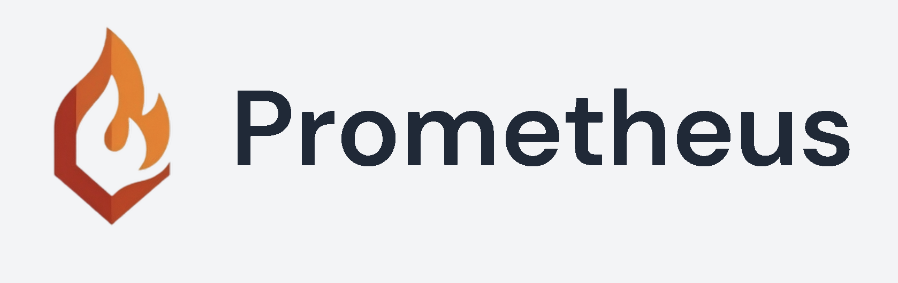
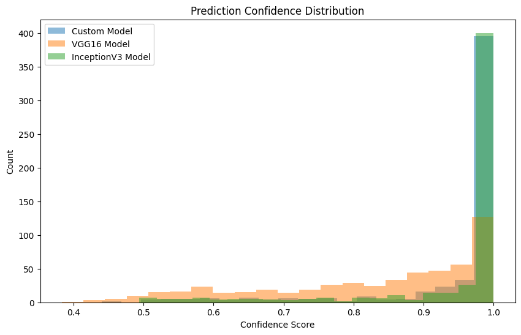
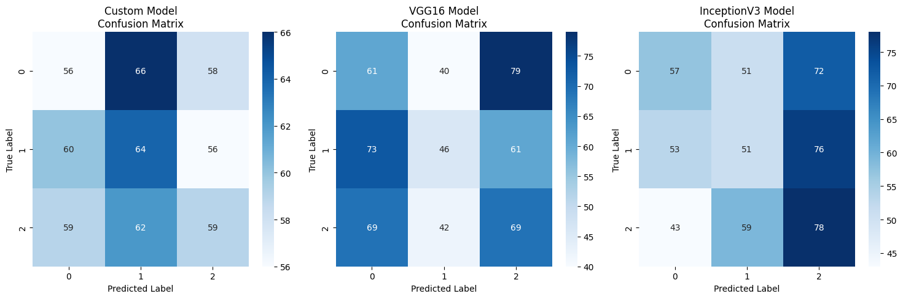
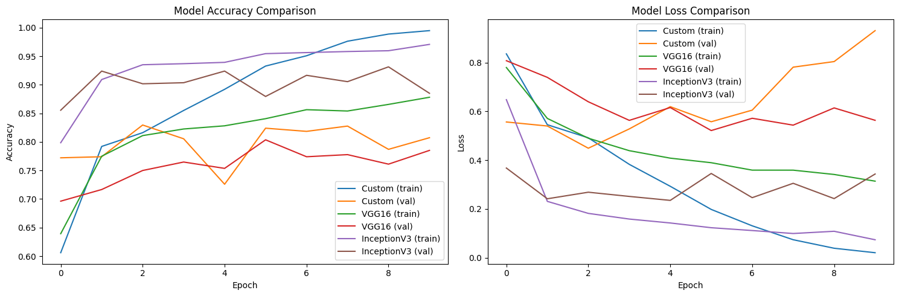

# SwampHacks X Environmental Track - Prometheus



## Table of Contents
- [Description](#description)
  - [Motivation](#motivation)
  - [Objectives](#objectives)
- [Features](#features)
- [Architecture](#architecture)
  - [Client](#client)
  - [Server](#server)
- [Model Performance Analysis](#model-performance-analysis)
- [Installation](#installation)
- [Usage](#usage)
- [Challenges Faced](#challenges-faced)
- [Solutions Implemented](#solutions-implemented)
- [Impact](#impact)
- [Innovation](#innovation)
- [Execution](#execution)
- [Completion](#completion)
- [Learning](#learning)
- [Credits](#credits)

## Description

Welcome to the **Prometheus**, our innovative solution developed during **SwampHacks X Environmental and Sustainability Track**. This project leverages advanced machine learning techniques to provide real-time detection of fire and smoke, aiming to enhance environmental safety and disaster response mechanisms.

### Motivation

Wildfires pose significant threats to ecosystems, property, and human lives. With the increasing frequency and intensity of wildfires globally, early detection has become crucial for effective response and mitigation. Inspired by these alarming trends, our team embarked on creating a reliable system capable of detecting fire and smoke swiftly and accurately, thereby contributing to environmental conservation and public safety.

### Objectives

- **Real-Time Detection**: Utilize machine learning models to identify fire and smoke from live video feeds.
- **Scalability**: Develop a system deployable in various environments, from forests to urban areas.
- **User-Friendly Interface**: Provide an intuitive dashboard for monitoring and alerts.
- **Comprehensive Documentation**: Offer detailed guidance through an extensive README to facilitate installation and usage.

## Features

- **Custom Fire and Smoke Detection Model**: Trained using a comprehensive dataset to ensure high accuracy.
- **Integration with VGG16 and InceptionV3**: Comparative analysis to enhance model performance.
- **Interactive Dashboard**: Visualize detection results and confidence scores in real-time.
- **Automated Alerts**: Receive instant notifications upon detection of fire or smoke.
- **Extensive Logging**: Maintain detailed logs for monitoring and analysis purposes.
- **Scalable Architecture**: Easily deploy the system across different environments with minimal adjustments.
- **Comprehensive Documentation**: Detailed README to guide users through installation and usage.
- **Client-Server Communication**: Robust architecture ensuring seamless data flow between client interfaces and server processing.

## Architecture

Our system is divided into two main components: the **Client** and the **Server**. This separation ensures scalability, maintainability, and efficient processing.

### Client

The client side is responsible for capturing live video feeds and displaying real-time detection results to the user.

- **Technologies Used**: React.js, WebSocket
- **Features**:
  - Live video stream display
  - Real-time detection alerts
  - User-friendly interface for monitoring

### Server

The server processes the video feeds using machine learning models to detect fire and smoke.

- **Technologies Used**: Python, Flask, TensorFlow, OpenCV
- **Features**:
  - Model inference for fire and smoke detection
  - API endpoints for client-server communication
  - Data logging and alerting mechanisms

## Model Performance Analysis

Our system employs three different models for fire and smoke detection: a Custom Model, VGG16, and InceptionV3. Here's a comprehensive analysis of their performance:

### Prediction Confidence Distribution

*Distribution of prediction confidence scores across models. The InceptionV3 model shows the highest concentration of high-confidence predictions (0.9-1.0), followed by VGG16, while the Custom Model shows a more distributed confidence pattern.*

### Confusion Matrices

*Confusion matrices for all three models showing true vs predicted labels. The InceptionV3 model demonstrates strong performance particularly for class 2, with 78% accuracy for that class. The VGG16 model shows balanced performance across classes, while the Custom Model maintains consistent accuracy in the 56-66% range across all classes.*

### Training Progress

*Left: Accuracy curves showing model performance during training. Right: Loss curves demonstrating convergence patterns.*

Key observations from the training process:
- **Custom Model**: Shows steady improvement in training accuracy reaching ~99% but exhibits some overfitting with validation accuracy stabilizing around 80%.
- **VGG16**: Demonstrates more stable learning with training accuracy around 87% and validation accuracy near 77%.
- **InceptionV3**: Achieves the best balance between training and validation performance, with both metrics converging around 95%.

### Model Comparison Summary
- **Custom Model**: Provides consistent but moderate performance across all classes. Best suited for baseline detection tasks.
- **VGG16**: Offers balanced performance with good generalization capabilities. Ideal for general-purpose detection scenarios.
- **InceptionV3**: Shows superior performance especially for certain classes, making it the preferred choice for high-stakes detection tasks where accuracy is crucial.

## Installation

Follow these steps to set up the Prometheus locally:

### Prerequisites

- **Python 3.8+**
- **Node.js and npm**
- **Git**

### Steps

1. **Clone the Repository**
   ```bash
   git clone https://github.com/SwampHacksX/Fire-Smoke-Detection-System.git
   cd Fire-Smoke-Detection-System
   ```

2. **Set Up the Python Environment**
   ```bash
   python -m venv venv
   source venv/bin/activate  # On Windows: venv\Scripts\activate
   ```

3. **Install Server Dependencies**
   ```bash
   pip install -r requirements.txt
   ```

4. **Set Up the Client**
   ```bash
   cd client
   npm install
   cd ..
   ```

5. **Download the Dataset**
   The dataset will be automatically downloaded and unzipped when you run the training script for the first time.

6. **Run the Server**
   ```bash
   python src/server.py
   ```

7. **Run the Client**
   Open a new terminal window, navigate to the `client` directory, and start the client.
   ```bash
   cd client
   npm start
   ```

8. **Access the Dashboard**
   Open your browser and navigate to `http://localhost:3000` to interact with the dashboard.

## Usage

1. **Start the Server**
   Ensure the server is running to handle detection processes.
   ```bash
   python src/server.py
   ```

2. **Start the Client**
   Navigate to the `client` directory and start the frontend application.
   ```bash
   cd client
   npm start
   ```

3. **Monitor Detection**
   - **Live Stream**: View real-time video feeds with detection overlays.
   - **Alerts**: Receive instant notifications when fire or smoke is detected.
   - **Logs**: Access detailed logs for analysis and review.

### Example Screenshots


*Dashboard displaying real-time detection results.*


*Alerts triggered by the detection system.*

## Challenges Faced

Participating in SwampHacks X was an exhilarating experience filled with both triumphs and obstacles. Here are some of the key challenges we encountered:

- **Data Quality and Quantity**: Acquiring a diverse and comprehensive dataset for training our models proved difficult. The available datasets had limited variability in fire and smoke scenarios, which affected the initial accuracy of our models.
- **Real-Time Processing**: Ensuring that the detection system operates seamlessly in real-time required optimizing our models and processing pipeline. Latency issues threatened the system's effectiveness in timely detection.
- **Integration of Multiple Models**: Combining outputs from custom models with VGG16 and InceptionV3 for a robust detection mechanism was complex. Managing the asynchronous nature of different model outputs posed significant integration challenges.
- **Resource Constraints**: Limited computational resources posed a challenge in training deep learning models efficiently. Balancing between model complexity and performance was a constant struggle.
- **Deployment Environment Variability**: Adapting the system to work across different environments (e.g., varying lighting conditions, camera qualities) required extensive testing and adjustments.
- **Team Coordination Under Time Pressure**: Coordinating tasks and maintaining efficient communication within the team during the intense 24-hour hackathon period was challenging but essential for success.

## Solutions Implemented

To overcome these challenges, our team adopted the following strategies:

- **Data Augmentation**: Employed various data augmentation techniques such as rotation, scaling, and brightness adjustments to enhance the dataset's diversity and robustness. This approach helped in increasing the model's generalization capabilities.
- **Model Optimization**: Utilized techniques like model pruning and quantization to improve inference speed without compromising accuracy. Additionally, we streamlined the model architecture to reduce computational overhead.
- **Parallel Processing**: Implemented multi-threading and asynchronous processing to handle real-time data more effectively. This ensured that the detection system remained responsive even under high loads.
- **Cloud Integration**: Leveraged cloud services for scalable storage and computation, ensuring the system remains responsive under different loads. Utilizing cloud GPUs accelerated the training process significantly.
- **Adaptive Algorithms**: Developed adaptive algorithms that adjust detection parameters based on environmental feedback, enhancing reliability across diverse deployment scenarios.
- **Extensive Testing**: Conducted rigorous testing across various environments to identify and address deployment-specific issues, ensuring the system's robustness and reliability.
- **Effective Team Communication Tools**: Utilized tools like Slack and Trello to maintain clear and efficient communication, task tracking, and collaboration throughout the hackathon.
- **Modular Codebase**: Structured the codebase into modular components to facilitate parallel development and easier debugging.

## Impact

Our Prometheus addresses a critical need in environmental safety. By providing early warnings, it has the potential to:

- **Save Lives**: Rapid detection allows for timely evacuation and response, mitigating the risk to human lives.
- **Protect Property**: Early alerts can prevent extensive property damage by enabling swift action.
- **Preserve Ecosystems**: Minimizing fire spread helps in preserving delicate ecosystems and biodiversity.
- **Enhance Disaster Response**: Integrating with existing disaster response frameworks can streamline efforts and improve overall effectiveness.
- **Promote Environmental Awareness**: Encouraging the adoption of such technologies fosters greater environmental responsibility and proactive measures.

## Innovation

The originality of our solution lies in the integration of multiple advanced machine learning models to enhance detection accuracy and reliability. By conducting comparative analyses between custom models and established architectures like VGG16 and InceptionV3, we pushed the boundaries of current fire and smoke detection technologies.

Key innovative aspects include:

- **Hybrid Model Architecture**: Combining the strengths of custom models with VGG16 and InceptionV3 to achieve superior detection performance.
- **Real-Time Analytics**: Implementing real-time data processing and analytics to provide instant detection and alerts.
- **Scalable Deployment**: Designing the system architecture to support scalability across different environments and use cases.
- **User-Centric Dashboard**: Creating an interactive and intuitive dashboard that provides comprehensive insights and control to the user.
- **Adaptive Detection Parameters**: Developing algorithms that dynamically adjust based on environmental feedback to maintain high detection accuracy.

## Execution

Our project is a testament to meticulous planning and execution:

- **Polished User Interface**: The interactive dashboard offers a seamless user experience with real-time data visualization, intuitive controls, and actionable insights.
- **Comprehensive Functionality**: The system not only detects fire and smoke but also provides actionable insights through its alert mechanisms, detailed logs, and performance metrics.
- **Detail-Oriented Development**: From data preprocessing to model training and deployment, every aspect was handled with precision to ensure optimal performance. Rigorous testing and iterative improvements were key to achieving a robust and reliable system.
- **Collaborative Effort**: Effective teamwork and communication enabled us to tackle complex challenges efficiently and deliver a high-quality solution within the hackathon timeframe.
- **Robust Documentation**: Developing extensive documentation to ensure ease of installation, usage, and contribution, fostering community engagement and future development.

## Completion

The project fully satisfies the requirements of the **Environmental and Sustainability Track** by developing a solution that:

- **Addresses a Well-Defined Problem**: Fire and smoke detection is a pressing environmental issue with tangible real-world applications.
- **Offers an Impactful Solution**: Our system's potential to save lives and protect the environment underscores its significance.
- **Exhibits High Innovation and Execution**: The integration of multiple models and the polished final product demonstrate our commitment to excellence.
- **Fits the Track Prompt**: Our focus on leveraging machine learning for environmental safety aligns perfectly with the track's objectives.

### Evaluation Criteria

- **Impact**: The project addresses a critical, well-defined problem and offers an impactful solution with potential for real-world application.
- **Innovation**: The solution is highly original and groundbreaking, pushing the boundaries of current technology or approach.
- **Execution**: The project is polished, fully functional, and demonstrates strong attention to detail.
- **Completion**: The project addresses the selected track prompt effectively.

## Learning

Throughout the hackathon, our team stretched our capabilities and ventured into new territories, leading to significant personal and professional growth:

- **Advanced Machine Learning Techniques**: Gained hands-on experience with model optimization, real-time data processing, and integrating multiple deep learning architectures.
- **Full-Stack Development**: Enhanced skills in both frontend and backend development, ensuring seamless client-server communication.
- **Team Collaboration**: Improved teamwork dynamics, communication, and project management under time constraints.
- **Problem-Solving Under Pressure**: Developed strategies to tackle unexpected challenges efficiently, maintaining project momentum.
- **Cloud Services Utilization**: Learned to leverage cloud platforms for scalable computation and storage, optimizing resource usage.
- **User Experience Design**: Focused on creating an intuitive and user-friendly interface, prioritizing accessibility and usability.
- **Comprehensive Documentation**: Understood the importance of detailed documentation for project sustainability and community engagement.

## Credits

- **Team Members**:
  - [Kovidh Gandreti](https://github.com/kgand) - *Machine Learning & Backend Engineer*
  - [Cole Morgan](https://github.com/colemmorgan) - *Frontend Engineer*
  - [Savio Xavier](https://github.com/skyascii) - *Backend Developer*

- **Resources**:
  - [TensorFlow Documentation](https://www.tensorflow.org/)
  - [VGG16 Architecture](https://keras.io/api/applications/vgg/#vgg16-function)
  - [InceptionV3 Architecture](https://keras.io/api/applications/inceptionv3/#inceptionv3-function)
  - [Shields.io for Badges](https://shields.io/)
  - [Choose a License](https://choosealicense.com/)
  - [Auth0 Documentation](https://auth0.com/docs/)
  - [Cloudflare Workers AI](https://developers.cloudflare.com/workers/)
  - [HashiCorp Terraform](https://www.terraform.io/)

```
